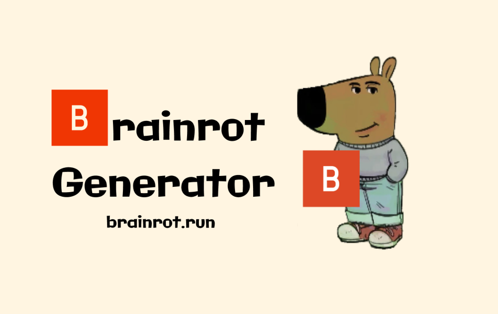

# [brainrot.run](https://brainrot.run)

<div align="center">
  
</div>

## Tech Stack:

- [Browserbase](https://browserbase.com/)
- [Stagehand](https://stagehand.dev/)
- [Anthropic](https://www.anthropic.com/)
- [Next.js](https://nextjs.org/)
- [Vercel](https://vercel.com/)
- [Upstash](https://upstash.com/)

## Getting Started

Add environment variables:

```bash
ANTHROPIC_API_KEY=
BROWSERBASE_API_KEY=
BROWSERBASE_PROJECT_ID=
KV_URL=
KV_REST_API_READ_ONLY_TOKEN=
KV_REST_API_TOKEN=
KV_REST_API_URL=
UPSTASH_REST_URL=
UPSTASH_REDIS_REST_URL=
UPSTASH_REDIS_REST_TOKEN=
PRODUCTION_URL=
```

Run the development server:

```bash
npm run dev
# or
yarn dev
# or
pnpm dev
# or
bun dev
```

Open [http://localhost:3000](http://localhost:3000) with your browser to see the result.
